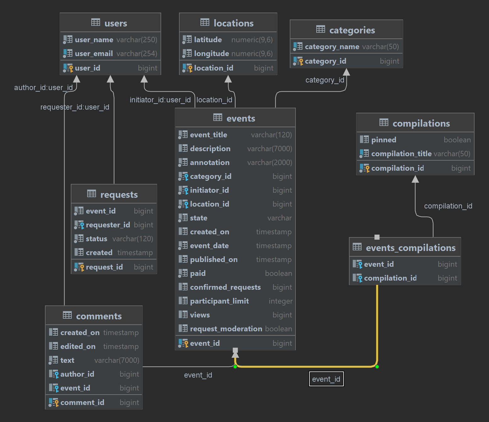

# java-explore-with-me
Template repository for ExploreWithMe project.

### Описание
Бэкэнд приложения для публикации и участия в различных интересных событиях.

Проект состоит из четырех микросервисов:
- основной сервис
- база данных основного сервиса
- сервис статистики
- база данных сервиса статистики

## Endpoints
- [Техническое задание для API основного сервиса](./ewm-main-service-spec.json)
- [Техническое задание для API сервиса статистики](./ewm-stats-service-spec.json)
- В качестве дополнительной фичи реализован функционал комментариев.

## Схема базы данных основного сервиса

